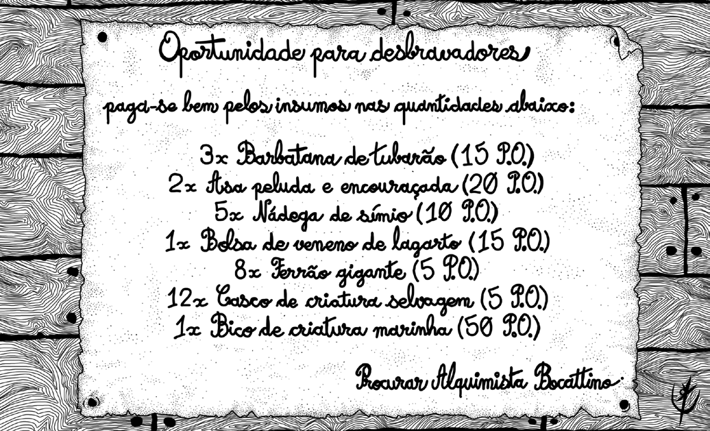
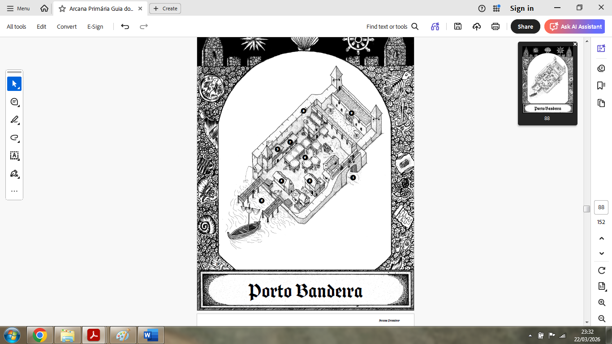

# Anotações

## Sessão n2 2026-03-29

O pessoal está em um porto, e o personagem do samuel sugere ir para a taverna. Se aproximando vemos o "Boteco Coral", já nos recebendo com uma briga.
Performance do Pietro ⭐⭐⭐⭐⭐, porém plateia bêbada.
Ladrão tentando roubar algo, normal, porém um grupo se reúne e começa a conversar.

Nos dias antes um combate com carangueijos aconteceu, algo sobrenatural.

Ben está procurando rumores, mas o taverneiro não sabe muito do norte.

Igreja de Porto Bandeija é de algum deus aquático, primogênito dos mares. Tem um cara estranho lá, com quem Samuel e Antônio conversam. 

O cara tem um sonho *Um grande Terremoto* , e depois disso eles voltam para a taverna. Alongo aposta em caçar demônios, Ben aposta nas ilhas ao sudoeste. Talvez investigar com a feiticeira poderemos encontrar respostas dos demônios.

A feiticeira se interessa por **ervas** e vende elixires **duvidosos** e é a feiticeira oficial da cidade, morando no subsolo da muralha. Ela conta que o povo é muito supersticioso e que no pântano existem **jacarés vampíricos**.

Sr. Gnomo conversa com o velho sobre o parasita do capitão, *mysterious*, inimigos?

Na taverna, à noite vemos um cara armadurado, contando histórias de guerra, até altas horas.

## Lista de troca da Feiteiceira

## Porto Bandeija

### Rumores
* rumor de gideon: "Há uma feiticeiro"
* rumor de Ben: "Há uma torre ao norte que foi abandonada por um mago"
  * casal de magos
* rumor sr. gnomo: "Epidemia na cidade"
* rumor do antônio: "Demônios atacando caravanas no norte"
* rumor do lewmas: "Criatura gigante"
* rumor do Pietro: "Região estranha, civilização antiga habitou a região mas sumiu misteriosamente"
* rumor da taverna: "Tesouro no pé do vulcão "
* rumor da taverna 2: "Luzes verdes na cordilheira"
* rumor da taverna 3: "Cartas não chegam a 3 dias"
* rumor da taverna 3: "Feiteiceira da cidade e conda são amantes"
* rumor da taverna 3: "No meio do pântano existem ruínas, sul"
* rumor do porto 1: "Piratas liderados por Pé de Latão, usam mangue de esconderijo"
* rumor do porto 2: "Estaleiro da lenha, ver recompensa depois com o capitão, passagem cara"

